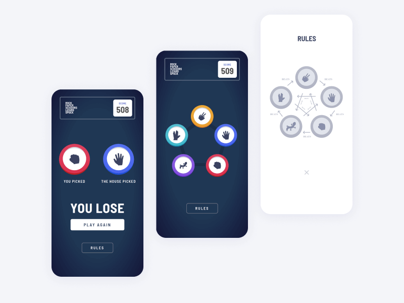

# Rock, Paper, Scissors, Lizard, & Spock ReactJS Minigame

This is a solution to the [Rock, Paper, Scissors challenge on Frontend Mentor](https://www.frontendmentor.io/challenges/rock-paper-scissors-game-pTgwgvgH).

## Table of contents

- [Rock, Paper, Scissors, Lizard, \& Spock ReactJS Minigame](#rock-paper-scissors-lizard--spock-reactjs-minigame)
  - [Table of contents](#table-of-contents)
  - [Overview](#overview)
    - [The challenge](#the-challenge)
    - [Screenshot](#screenshot)
    - [Links](#links)
  - [My process](#my-process)
    - [Built with](#built-with)
  - [Author](#author)
  - [⚒ Usage](#-usage)
    - [👥 Clone the repo](#-clone-the-repo)
    - [📦 Install dependencies](#-install-dependencies)
    - [✨ Start/Run the app](#-startrun-the-app)

## Overview

### The challenge

Users should be able to:

- View the optimal layout for the game depending on their device's screen size
- Play Rock, Paper, Scissors, Lizard, Spock against the computer
- Maintain the state of the score after refreshing the browser

### Screenshot




### Links

- Solution URL: [Github](https://github.com/metkerr/rock-paper-scissors-react-minigame.git)


- Live Site URL: [Live on Vercel](http://rock-paper-scissors-react-game.vercel.app/)

## My process

### Built with

- Semantic HTML5 markup
- Flexbox
- Mobile-first workflow
- [React](https://reactjs.org/) - JS library
- [Tailwind](https://tailwindcss.com/) - For styles
- [CC0 Sound Effects by Kenney Vleugels](https://kenney.nl/assets?q=audio) - Audio/Sound effect assets

## Author

- Website - [Metker](https://metkerr.github.io/)
- Frontend Mentor - [@metkerr](https://www.frontendmentor.io/profile/metkerr)
- Twitter - [@metkerr](https://twitter.com/metkerr)

## ⚒ Usage
 ### 👥 Clone the repo

 ```shell
 $ git clone https://github.com/metkerr/rock-paper-scissors-react-minigame.git
 ```

### 📦 Install dependencies
```shell
$ cd rock-paper-scissors-react-minigame
$ npm install
```

### ✨ Start/Run the app
```shell
$ npm start
```